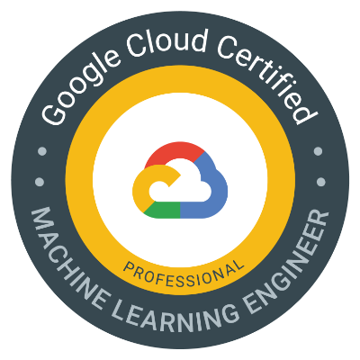

# Google Cloud Certified - Professional Machine Learning Engineer

## Machine Learning Concept

- A way to derive **repeated predicted insights from data**
- Stages insist of: Training and Inference (Prediction)
- Considered to provide *scalable*, *automatic* and *personalized* solutions

## Framing a business problem as a machine learning problem

1. cast it as a machine learning problem

- [x] what is being predicted?
- [x] what data is needed?

2. cast it as a software problem

- [x] what is the API for the problem during prediction?
- [x] who will use the prediction service?
- [x] How are they doing it today?

3. cast it in the framework of a data problem

- [x] what are some key actions to collect, analyze, predict and react to the data or predictions?

## vertex Notebooks

- managed notebooks

    :white_check_mark: control hardware (GPUs, RAM)

    :white_check_mark: custom containers (add custom container images)

    :white_check_mark: use Cloud Storage and BigQuery extension to browse data

    :white_check_mark: Dataproc integration

- user-managed notebooks

    Ideal for:
    * heavily customized Deep Learning VM 
    * health status monitoring
    * have specific network and security needs (set VPC service control)

Both notebooks are protected by Google Cloud authentication and authorization

Both notebooks support GPU accelerators and sync with Github repository

Both notebooks are pre-packaged with JupyterLab and have a pre-installed suite of deep learning packages, including support for the TensorFlow and PyTorch frameworks

## Best practices for machine learning on Vertex AI

### Best practices for data preprocessing

- Structured data (tabular data)

    :white_check_mark: recommended to store in BigQuery

    :white_check_mark: use materialized data instead of views or sub-queries for maximum training speed

- Unstructured data

    :white_check_mark: recommended to use **Dataflow** to process

    :white_check_mark: recommended to store in Cloud Storage

    :white_check_mark: TFRecord files for Tensorflow or AVRO files for other framework

    :white_check_mark: combine many individual images, videos or audio clips into large files

- Use data labeling for unstructured data

- Use Feature Store for structured data (online serving of features for online prediction)

### Best practices for training a model

- For small datasets, train a model within the **Notebook instance**

- For large datasets, distributed training or scheduled training, use the **Vertex training service**

### Best practices for Explainable AI

- Details the importance of each feature that a model uses as input to make a prediction

- Supports custom-trained models based on tabular and image data

### Best practices for Hyperparameter tuning

- Automatically adjust hyperparameters

### Nest practices for using Vertex AI Tensorboard

- track experiment metrics such as loss and accuracy 
- visualize a model graph
- project embeddings to a lower space
